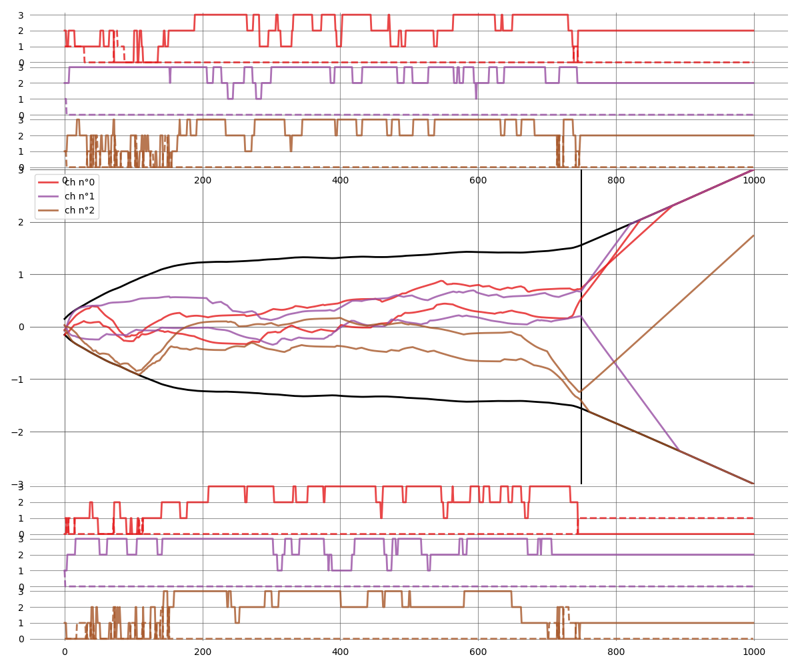

# `kt_simul` - Python model of chromosome mouvements during mitosis

Python model of chromosome mouvements during mitosis in Fission Yeast
(http://mitotic-machine.org).

This python module provides the simulation of mitotic spindle elements (for now,
the kinetochore and the spindle pole bodies), during cell division in fission
yeast. For more details see [online documentation](http://bnoi.github.io/kt_simul/ "kt_simul documentation").

If you're interested in this work, please contact :

- Sylvie Tournier (sylvie.tournier-gachet@univ-tlse3.fr) for
  all aspects related to the biology and for academical collaboration purposes.
- Guillaume Gay (gllm.gay@gmail.com) for all aspects related to the code

The underlying model is fully described in:

G. Gay, T.Courthéoux, C. Reyes, S. Tournier, Y. Gachet. *A stochastic model of
kinetochore–microtubule attachment accurately describes fission yeast chromosome
segregation* J. Cell Biol 2012 [(link to article)](http://jcb.rupress.org/content/196/6/757.abstract).

This article should be used for any citation of this work.

Funding
-------

This project is funded by the French National Research Agency as:
   *ANR- BLAN 1206 01 Chromocatch, programme blanc 2010*

Contributors
------------

- Guillaume Gay <gllm.gay@gmail.com> : main author
- Hadrien Mary <hadrien.mary@gmail.com> : contributor

`kt_simul` is part of the BNOI Project <https://github.com/bnoi>.


Licence
-------

This code is provided under the GPL compatible CeCILL licence (see
LICENCE for full details).

Dependencies
------------

- Python 2.7 and Python 3.4
- numpy >= 1.8
- scipy >= 0.12
- cython >= 0.19
- pandas >= 0.15.2
- matplotlib (optional) >= 1.2
- PyQt4 (optional)

Installation
------------

You can directly clone this repo, then install with setuptools:

    git clone https://github.com/bnoi/kt_simul.git
    cd kt_simul/
    python setup.py build
    python setup.py install

Or you can install `kt_simul` via pip (dependencies will be automatically
installed):

    pip install -e git+https://github.com/bnoi/kt_simul.git#egg=master

You will need a C compiler for the cython part.

Usage
-----

```python
from kt_simul.io.xml_handler import ParamTree
from kt_simul.core.simul_spindle import Metaphase
from kt_simul.io.simuio import SimuIO
from kt_simul.core import parameters

PARAMFILE = parameters.PARAMFILE
MEASUREFILE = parameters.MEASUREFILE

# Change some parameters
paramtree = ParamTree(PARAMFILE)
paramtree.change_dic('dt', 10)
paramtree.change_dic('span', 2000)
paramtree.change_dic('t_A', 1750)

measuretree = ParamTree(MEASUREFILE, adimentionalized=False)

# Init simu
meta = Metaphase(verbose=True, paramtree=paramtree, measuretree=measuretree, initial_plug='random')

# Launch simu
meta.simul()

# Save results
SimuIO(meta).save("simu.h5")

# Show trajectories (matplotlib needed)
meta.show()
```



Simulation can be "played" with Qt based GUI:

```python
from kt_simul.gui.animation import Animator

anim = Animator(meta)
anim.play()
```


